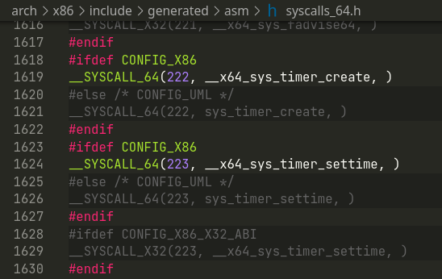
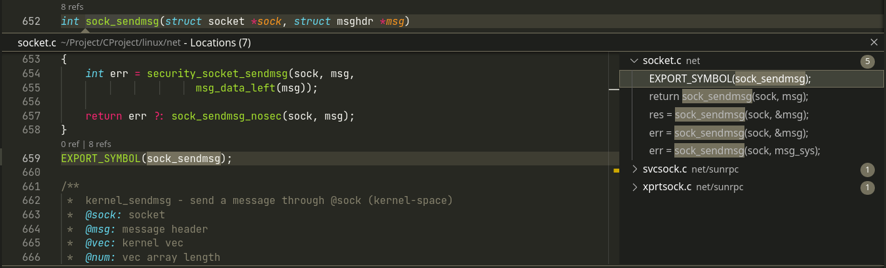

# IDE 配置 - C/C++

<!-- toc -->

## 背景

linux下并没有 [Visual Studio](https://visualstudio.microsoft.com/) 这种巨无霸  
而老一辈的程序员又各种推崇 [Vim](https://www.vim.org/ "vim") 这种上古的工具(虽然也不是不能用)  
导致linux下搜索 C/C++的开发环境, 几乎都是 [vim](vim) + [ctags](https://github.com/universal-ctags/ctags) 这种组合, 其中比较有名的应该是在知乎下的[如何在 Linux 下利用 Vim 搭建 C/C++ 开发环境?](https://www.zhihu.com/question/47691414/answer/373700711) 的 [韦易笑](https://www.zhihu.com/people/skywind3000) 的答案.

但, 太折腾了. 各种配置参数, 各种不明觉厉的配置和插件, 以及莫名其妙的不兼容.

因此, 整一个适合自己的, 容易复刻的C/C++ IDE环境, 还是有必要的.

## 目标

平常很少写 c/c++, 多是在看一些库的代码和实现, 因此方便阅读是主要目的.  
而巨硬出的插件[]()在linux下cpu拉满, 体验太不好.

## 安装

> 经过一些搜索, 发现了 宝藏文 [2022 年 vim 的 C/C++ 配置](https://martins3.github.io/My-Linux-Config/docs/nvim.html), 虽然也是 vim的配置, 但是给了很大的启发.

* 主体: 
  * [VSCode](https://code.visualstudio.com/ "VSCode")
  * [ccls](https://github.com/MaskRay/ccls "ccls")
  * [Bear](https://github.com/rizsotto/Bear "Bear")
  * [CMake](https://cmake.org/)
* 插件:
  * [ccls](https://marketplace.visualstudio.com/items?itemName=wallenwang.ccls-plus)
  * [CodeLLDB](https://marketplace.visualstudio.com/items?itemName=vadimcn.vscode-lldb "CodeLLDB")

安装完软件, 在打开具体项目时还需要进行一些设置.

**说明**: 核心是生成一个[ccls](ccls)能识别的`compile_commands.json`文件, 文件说明可见 [JSON Compilation Database Format Specification](https://clang.llvm.org/docs/JSONCompilationDatabase.html)

## 示例

### 示例1 - [linux-kernel](https://www.kernel.org/)

1. 拉取代码
    * 可以使用国内镜像

    ```bash
    git clone git@github.com:torvalds/linux.git
    ```

2. 使用`v5.4`版本
   * 5.0以上的就行, 主要是偷懒

   ```bash
   cd linux
   git checkout v5.4
   ```

3. 构建项目
   * 毕竟有一些宏是不是生效, 环境变量是怎样的, 只有构建了才知道
   * 这里编译器用了clang, 也可以用gcc

    ```bash
    make CC=clang defconfig
    make CC=clang -j $(nproc)
    ```

4. 生成 `compile_commands.json`

    ```bash
    ./scripts/gen_compile_commands.py #5系列的版本有脚本gen_compile_commands.py 不然就用bear自己生成
   ```

5. 用 vscode 打开项目, 等待一小会的加载, 即可享受丝滑体验
    
    

### 示例2 -- levledb

1. 拉取代码

    ```bash
    git clone git@github.com:google/leveldb.git
    ```

2. 构建

    ```bash
    cd leveldb
    git submodule init
    git submodule update
    cmake -DCMAKE_EXPORT_COMPILE_COMMANDS=on .
    cmake --build .
    ```

3. 如果使用 [VSCode](VSCode), 在项目下添加如下配置

    ```json
    {
        "cmake.configureArgs": [
            "-DDCMAKE_EXPORT_COMPILE_COMMANDS=ON"
        ],
    }
    ```

4. 这样会在项目的 `build` 目录中生成 `compile_commands.json`
    * 需要修改 ccls 插件配置, 让它找到这个文件

    ```json
    {
        "ccls.misc.compilationDatabaseDirectory": "build"
    }
    ```

### 示例3 -- postgres

1. 拉取代码

    ```bash
    git clone git@github.com:postgres/postgres.git
    ```

2. 构建

    ```bash
    cd postgres
    ./configure
    bear -- make -j `nproc`
    ```

3. 这样使用 [Bear](Bear)生成了`compile_commands.json`