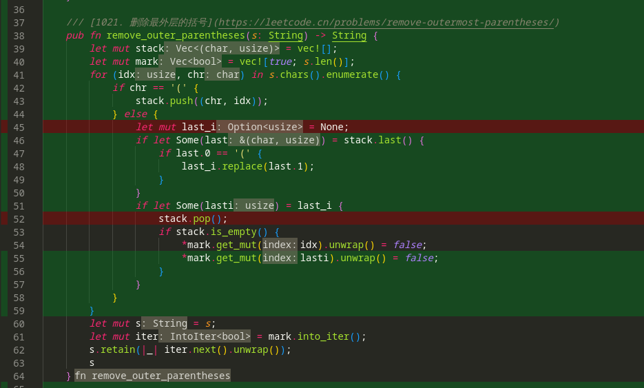

# IDE 配置 -- Rust

<!-- toc -->

## 概述

除了能自动补全, 还能测试, 还能覆盖率.

## 安装

* 主体: [VSCode](https://code.visualstudio.com/ "VSCode")
* 插件:
  * [rust-analyzer](https://marketplace.visualstudio.com/items?itemName=matklad.rust-analyzer "rust-analyzer")
  * [CodeLLDB](https://marketplace.visualstudio.com/items?itemName=vadimcn.vscode-lldb "CodeLLDB")
  * [crates](https://marketplace.visualstudio.com/items?itemName=serayuzgur.crates "crates")
  * [Better TOML](https://marketplace.visualstudio.com/items?itemName=bungcip.better-toml "Better TOML")
  * [Coverage Gutters](https://marketplace.visualstudio.com/items?itemName=ryanluker.vscode-coverage-gutters "Coverage Gutters")

安装完插件, 基本环境就有了, 自动补全, 测试, run.

## 基本配置

```json
{
    "rust-analyzer.lens.methodReferences": true,
    "rust-analyzer.lens.references": true,
    "rust-analyzer.procMacro.enable": true,
    "rust-analyzer.hoverActions.references": true,
    "rust-analyzer.inlayHints.hideNamedConstructorHints": true,
}
```

## debug

debug需要额外配置一下.

```json
{
    "rust-analyzer.debug.engine": "vadimcn.vscode-lldb",
    "rust-analyzer.debug.openDebugPane": true,
}
```

## coverage

基础的测试, `RA` 已经支持了. 如果需要 *coverage* 信息, 还需要额外安装一些工具.  
目前只有 *nightly* 支持

1. 安装额外工具 [grcov](https://github.com/mozilla/grcov "grcov"):

    ```bash
    cargo install grcov
    ```

2. 设置`rust-toolchain`, 参考 [Overrides](https://rust-lang.github.io/rustup/overrides.html#overrides "Overrides")

    ```toml
    [toolchain]
    channel = "nightly"
    components = [ "llvm-tools-preview", "rust-analyzer"]
    ```

3. 设置 `cargo-config`, 
    * 参考 [Configuration](https://doc.rust-lang.org/cargo/reference/config.html#configuration "Configuration")
    * 原理见 [instrument-coverage](https://doc.rust-lang.org/stable/unstable-book/compiler-flags/instrument-coverage.html#instrument-coverage "instrument-coverage")
    * 这样执行`cargo test`和`cargo build` 时自动生成`target/coverage/grcov.profraw` 文件

    ```toml
    [build]
    rustflags = ["-Cinstrument-coverage",]
    [env]
    LLVM_PROFILE_FILE = "target/coverage/grcov.profraw"
    ```

4. 利用 [grcov](https://github.com/mozilla/grcov "grcov") 产出 *lcov.info* 文件
    * `lcov.info` 文件就是覆盖率结果, 可以直接查看, 也可以产出html, 可以上传 [Codecov](https://about.codecov.io/ "Codecov")
    * 至于`lcov`是啥, 见[lcov详情](https://github.com/linux-test-project/lcov "lcov详情")

    ```bash
    grcov $(find . -name "grcov.profraw" -print) \
      --branch \
      --ignore-not-existing \
      --binary-path ./target/debug/ \
      -s . \
      -t lcov \
      --ignore "/*" \
      -o target/coverage/lcov.info
    ```

5. 借助[Coverage Gutters](Coverage Gutters) 显示覆盖率
   * 打开对应文件, 在 状态栏即可看到对应的 覆盖率, 点击可在文件上切换显示
    
    

### 自动生成lcov.info

手动生成`lcov.info` 文件太费事了, 可以监听 `target/coverage/grcov.profraw` 文件变化, 再自动生成.

1. 安装额外工具: `cargo install watchexec-cli`
2. 添加 [VSCode Task](https://code.visualstudio.com/docs/editor/tasks#_background-watching-tasks "VSCode Task"),

    ```json
    {
        "version": "2.0.0",
        "tasks": [
            {
                "label": "watch coverage",
                "type": "shell",
                "isBackground": true,
                "command": "~/.cargo/bin/watchexec",
                "args": [
                    "--no-vcs-ignore",
                    "-w", "target/coverage/grcov.profraw",
                    "-e", "profraw",
                    "--restart",
                    "~/.cargo/bin/grcov target/coverage/grcov.profraw --branch --ignore-not-existing --binary-path ./target/debug/ -s . -t lcov --ignore \"/*\" -o target/coverage/lcov.info"
                ],
                "problemMatcher": {
                    "pattern":[
                        {
                            "regexp": "^error:\\s+(.*)$",
                            "file": 1,
                            "line": 0,
                            "message": 1
                        }
                    ],
                },
                // 如果需要开启项目后自动启动
                // 可能会进程泄露, 暂时没有处理好 problemMatcher
                // "runOptions": {
                //     "runOn": "folderOpen"
                // },
                "presentation": {
                    "echo": true,
                    "reveal": "always",
                    "focus": false,
                    "panel": "shared",
                    "showReuseMessage": true,
                    "clear": true
                }
            }
        ]
    }
    ```

说明:

* 只是简单能用
* 没有使用 [cargo-llvm-cov](https://github.com/taiki-e/cargo-llvm-cov "cargo-llvm-cov"), 不想自己改`alias` , 还有就是 内嵌的 `Run test` 就不好用了.
* 可以用 makefile
